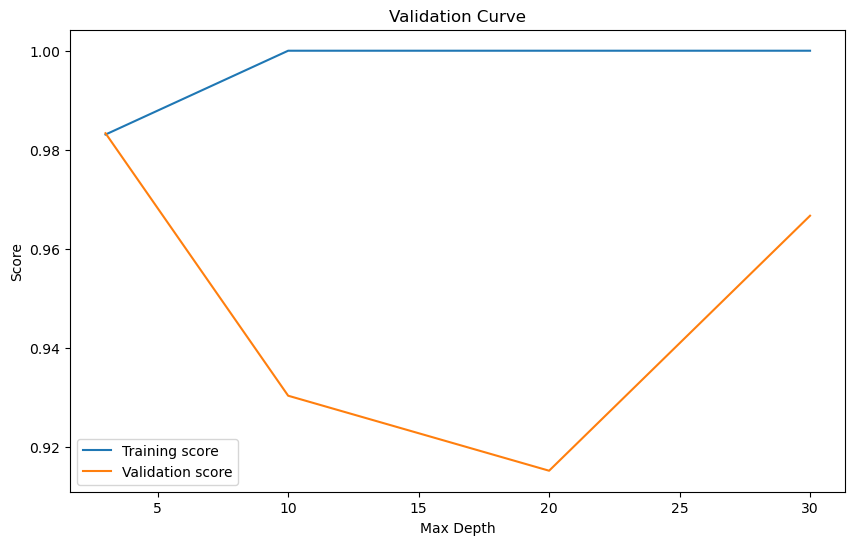
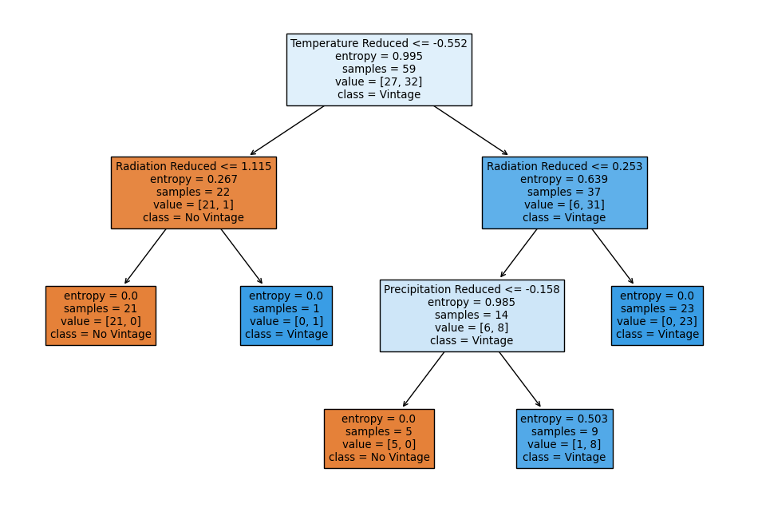
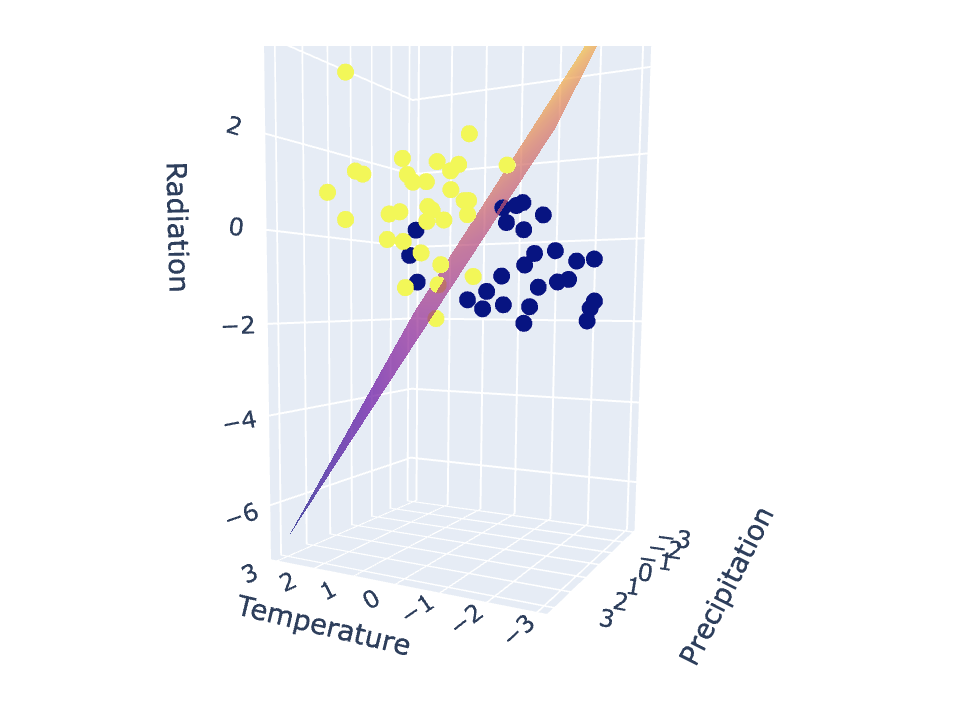

# Introduction
Dom Pérignon is a renowned brand of vintage Champagne produced by the French Champagne house Moët & Chandon, which is a part of the luxury goods company LVMH (Louis Vuitton Moët Hennessy). It is named after Dom Pérignon, a Benedictine monk who made important contributions to the production and quality of Champagne in the 17th century.

Dom Pérignon Champagne is known for its exceptional quality and prestige. It is made exclusively from Chardonnay and Pinot Noir grapes grown in the Champagne region of France. Each bottle is produced as a vintage Champagne, meaning it is made from grapes harvested in a single year, and only the best grapes are selected for production.

Dom Pérignon Champagne is characterized by its complexity, depth, and elegance. It undergoes a meticulous process of production, including hand harvesting, gentle pressing of the grapes, and aging in the cellars for several years before release. The final product typically exhibits a fine balance of fruitiness, minerality, and a creamy texture, with delicate bubbles.

Dom Pérignon is often regarded as one of the finest and most prestigious Champagnes in the world, sought after by collectors and enthusiasts alike for special occasions and celebrations. Its distinctive bottle design and iconic label contribute to its status as a symbol of luxury and excellence in the world of Champagne.

## Motivation

The short answer here is curiosity. Dom Pérignon is not produced every year. Only certain years produce a grape of high enough quality that they release a batch of champagne. The last vintage was released in 2013. Can we use different weather data along with machine learning classifiers to predict which new years will yield Dom Pérignon vintages.

## Previous Work

In researching this particular topic, the team could not find any examples of predicting Dom Pérignon vintages with machine learning. As far as our research could determine, this is the first instance of this project being completed. This is an entire novel topic as far as we could tell.

# Data

Data is collected from two sources. The first source is where all of the necessary features were collected from. This is all of the weather data collected from the Open-Meteo API. Data collected from the source include three different parameters for every day of the year from January 1, 1940 until December 31, 2023. The labels were webscraped from the Dom Perignon Wikipedia Page.

## Features

The three features used in the classification model were:

* Average daily temperature at 2 meters in altitude 
  * Temperature is really important for grapevines. In Champagne, where it's usually cool, grapes grow well, with a good balance of acidity and sugar. But big swings in temperature can mess up the timing of important stages like when buds appear, flowers bloom, grapes change color, and when they're ready to pick. If it gets too hot or too cold, there might be fewer grapes, they might taste different, or the vines could get stressed or harmed. Warmer weather can also mean grapes are ready to harvest earlier, which can change how the wine tastes compared to the traditional style of the region.
* Total daily precipitation
  * Rain is important for helping grapevines grow by giving them enough water. But too much rain, especially when the grapes are flowering or starting to form, can cause problems like bad pollination, more diseases, and making the grapes taste less flavorful. On the other hand, if there's not enough rain for a long time, it can stress out the vines, make fewer grapes grow, and make the grapes taste sweeter. Getting the right amount of rain at the right time is really important for keeping the grapes healthy and making good wine in Champagne.
* Mean shortwave radiation
  * Sunlight is really important for grapevines because it helps them make sugars and other stuff they need to ripen. Having enough sunlight makes the grapes ripen evenly, gives them good color, and makes them taste better. But if there's too much sunlight and heat, it can burn the grapes and make them ripen unevenly, which isn't good for the wine. Also, changes in clouds and weather can change how much sunlight reaches the grapes, which can affect how they grow and taste.
 
Other factors impact grape production and the resulting wine; however, for the purposes of this study we decided to focus on only these three. Further analysis could involve using extreme values rather than averages as those can have dramatic impacts on growth.

## Labels

The labels for this data are binary. Either a year produces a Dom Pérignon vintage or a year does not. For the purposes of building the classification model, these will be represented as boolean values:

* `True` - a year produced a Dom Pérignon vintage
* `False` - a year did not produce a Dom Pérignon vintage

Labels were only obtained for the years 1940 through 2013. After 2013, announcements have not been made as it usually takes approximately 10 years for the champagne house to release a vintage. Data from 2014 through 2023 is purely a prediction and will only be validated once the next few vintages get announced.

## Pre-processing

Pre-processing was critical for this model. Certain features were missing some datapoints which needed to be filled in. Certain assumptions were made when filling in values. For precipitation any empty values were filled in with 0 while for radiation and temperature empty values were filled in with the mean for that day over the years.

For each of the above mentioned features every year had 365 individual values that corresponded to that year. This made the original dataset have a dimensionality of $3 \times 84 \times 365$. For analysis, the goal was to reduce the dimensionality of this to $3 \times 84$. This was achieved using Linear Discriminant Analysis.

To accomplish this process, the scikit-learn library was employed. Utilizing the `LinearDiscriminantAnalysis` class and implementing the `svd` solver, three different models were built and trained. One for each of the features which allowed for the data to be reduced down to a single value per year for each of the three features.

LDA has some drawbacks in the form of its assumptions. LDA assumes that the data has a Gaussian distribution and that the covariance matrices of the different classes are equal. This was determined to be accurate. It also assumes that the data is linearly separable, meaning that a linear decision boundary can accurately classify the different classes (Wang et al.). This is not entirely the case with the data; however, there are few enough outliers that we decided to proceed with this method.

# Supervised Learning Models

The ultimate aim of this project was to correctly classify the data into two classes. We decided to use three different methods of classification to determine which model is most effective in this scenario. The models that we used were:

* Support Vector Machines (SVM)
* Random Forest
* Logistic Regression

To determine the best model, we looked at both training and testing accuracy. Using Scikit-learn's function `train_test_split` the data was broken into two groups with 80% used for training while the remaining 20% was reserved for testing.

## Support Vector Machines (SVM) 

Support Vector Machine (SVM) is a prominent algorithm in supervised learning, particularly suited for classification and regression tasks. Its aim is to establish an optimal hyperplane within a high-dimensional feature space, effectively separating distinct classes while maximizing the margin between them. This approach, whether in linearly separable or non-linearly separable datasets, relies on sophisticated kernel functions to implicitly map data into higher-dimensional spaces. SVM's robustness and versatility render it invaluable across diverse domains such as image analysis, natural language processing, and bioinformatics, where precise classification is paramount. (Awad and Khanna)

SVM was fit to the model data using the Scikit-learn library. The first step in fitting this was to create a pipeline which preprocessed the data using standard scalar. This step scales the features so that they have a mean of 0 and a standard deviation of 1. This preprocessing step is crucial for many machine learning algorithms, including SVM, as it ensures that all features contribute equally to the model fitting process. The model was configured in a way that it would automatically choose the correct $\gamma$ value.

Results from fitting SVM to the data are as follows.

 * The model achieved a training accuracy of $93.22\%$
 * The model achieved a testing accuracy of $86.667\%$

## Random Forest

Decision trees are a fundamental machine learning algorithm used for classification. Decision trees work by recursively splitting the data into subsets based on the features that best separate the target variable. Each split aims to maximize the purity of the resulting subsets, often measured by metrics like *entropy*. Random Forest, on the other hand, is an ensemble learning method that builds multiple decision trees and combines their predictions to improve accuracy and robustness. By training each tree on a random subset of the data and features, Random Forest reduces overfitting and generalizes well to unseen data, making it a popular choice for a wide range of classification problems.

Entropy is a crucial concept in decision trees, guiding the process of feature selection and node splitting. The goal is to minimize entropy at each node, indicating greater homogeneity within resulting subsets. Decision trees iteratively evaluate features and select the split that maximally reduces entropy, leading to more distinct and informative branches. Entropy-based splitting facilitates the creation of a tree structure that efficiently partitions the data based on the target variable, enabling accurate predictions. By leveraging entropy, decision trees offer a principled approach to classification and regression tasks, contributing to their widespread application in machine learning.

In fitting the model, the first step was to determine the optimal depth of the decision tree. Fitting a validation curve involves training decision trees with varying depths and evaluating their performance on a validation dataset. By plotting the relationship between tree depth and model performance metrics, such as accuracy or error rate, practitioners can identify the optimal depth that maximizes predictive power while mitigating overfitting.

Based on the above validation curve, the optimal depth was determined to be three. This fits logically with the data have three different features. 

Fitting a random forest using Scikit-learn yields multiple decision trees which when combined gives the following results:

* Training Accuracy: $98.305\%$
* Testing Accuracy: $86.667\%$

A sample resulting decision is as follows:

This model yielded an incredibly high training accuracy; however, it struggles to perform on the testing data. This could be due to overfitting. Overfitting happens when a model memorizes the training data's noise instead of learning its patterns well. This makes the model perform well on training data but poorly on new, unseen data. To avoid this, we use techniques like regularization, cross-validation, and adjusting model complexity, which help the model generalize better to new data.

## Logistic Regression

The final model fit was logistic regression. Logistic regression is a statistical method used for binary classification tasks. This makes it perfect for this situation because we have two classes. It models the probability that a given input belongs to one of the two classes using the logistic function, also known as the sigmoid function. The logistic regression algorithm estimates the parameters of the logistic function by minimizing a loss function, typically the cross-entropy loss, through optimization techniques like *gradient descent*. Logistic regression is a linear model and makes predictions based on a linear combination of input features. 

Gradient descent is an optimization algorithm used to minimize the loss function of a machine learning model by iteratively adjusting its parameters. It works by calculating the gradient of the loss function with respect to each parameter and updating them in the direction that decreases the loss. The model fit here uses logistic regression to generate the optimal decision boundary.

The logistic regression model fit here was built from the ground up. It was trained using 10,000 decision epochs and a learning rate of .01. The model yielded the following results:

* Training Accuracy: $91.525\%$
* Testing Accuracy: $93.333\%$

This model was decided to be the most accurate due to its high level of accuracy with the testing data as well as with the training data. The decision boundary generated by this model is a two dimensional plane in $\mathbb{R}^3$. The equation for this is as follows:

$$
z = \frac{0.174 + 1.683x + 1.01 y}{1.211}
$$

Graphing the decision boundary appears as follows:

# Discussion

After fitting all three of the models, it was determined that logistic regression was the best model for future prediction. This model is what was used in future predictions. 

The purpose of this project was to predict the the next few years of Dom Pérignon vintages. The last vintage released was in 2013. Vintages are released approximately 10 years after they are grown. 

Passing in the weather data from 2014 - 2023 into the logistic regression model gives the years of 2016 and 2020 producing Dom Pérignon champagne. While there is no way to validate this information, it is interesting to see the possibilities. 

## Next Steps

Additional analysis may involve fine-tuning the selection and quantity of features utilized in the prediction process. Neural networks offer a promising alternative model, boasting improved hyperparameter optimization capabilities. The implementation of deep neural networks could potentially yield even greater accuracy, although it may come with the trade-off of increased time and computational resources.

[Project GitHub Repository Link](https://github.com/jacob-p-schroeder/Dom-Perignon-Vintage-Analysis)

# References

Awad, Mariette, and Rahul Khanna. “Support Vector Machines for classification.” *Efficient Learning Machines*, 2015, pp. 39–66, https://doi.org/10.1007/978-1-4302-5990-9_3. 

Samajpati, Bhavini J., and Sheshang D. Degadwala. “Hybrid approach for Apple Fruit Diseases Detection and classification using random forest classifier.” *2016 International Conference on Communication and Signal Processing (ICCSP)*, Apr. 2016, https://doi.org/10.1109/iccsp.2016.7754302. 

Wang, Sheng, et al. “Semi-supervised linear discriminant analysis for dimension reduction and classification.” *Pattern Recognition*, vol. 57, Sept. 2016, pp. 179–189, https://doi.org/10.1016/j.patcog.2016.02.019. 

